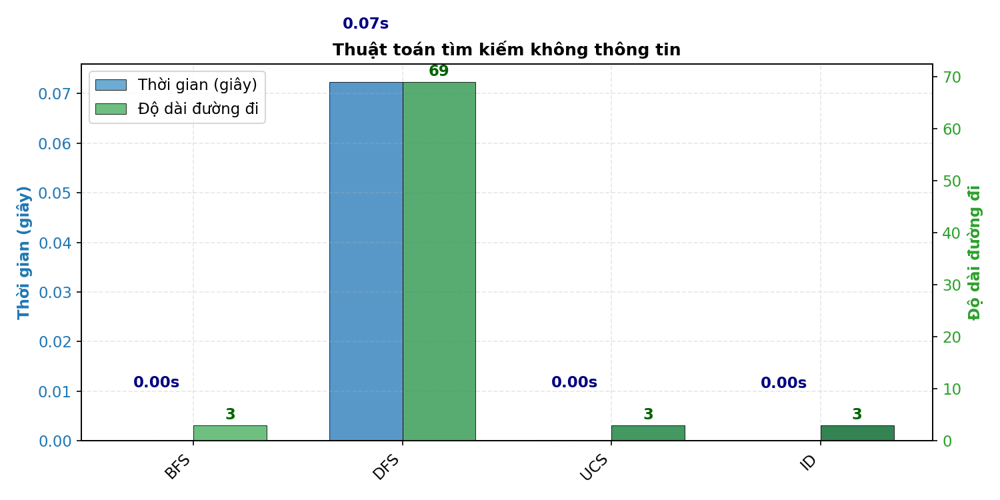
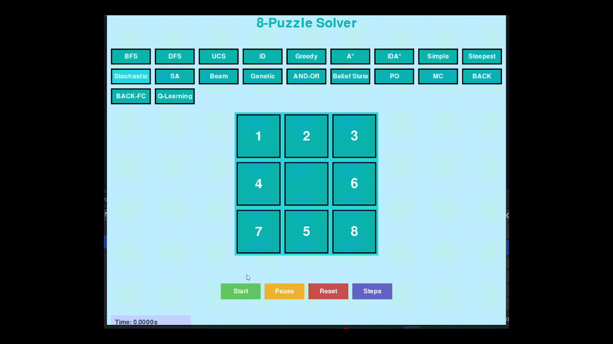
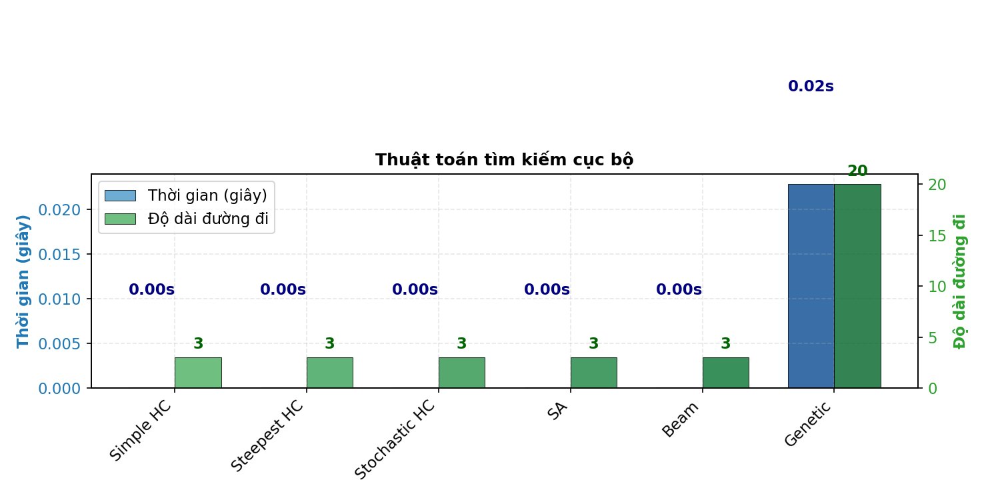

# 8-Puzzle Solver AI
Sinh viên thực hiện: Phan Việt Tuấn - MSSV: 23110355
Báo cáo cá nhân bộ môn Trí Tuệ Nhân Tạo
## Mục tiêu
Xây dựng một hệ thống trực quan hóa và so sánh các thuật toán AI giải bài toán 8-puzzle, bao gồm các nhóm thuật toán tìm kiếm, ràng buộc, học tăng cường và môi trường phức tạp. Dự án giúp sinh viên hiểu rõ bản chất, hiệu suất và ứng dụng của từng thuật toán thông qua giao diện trực quan và các phép đo hiệu suất.

---
## Điều hướng nhanh
- [Thành phần chính của bài toán tìm kiếm](#1-thành-phần-chính-của-bài-toán-tìm-kiếm)
- [Uninformed Search Algorithms](#21-uninformed-search-algorithms)
- [Informed Search Algorithms](#22-informed-search-algorithms)
- [Local Search Algorithms](#23-local-search-algorithms)
- [Complex Environment Search](#24-complex-environment-search)
- [Constraint Satisfaction Problems](#25-constraint-satisfaction-problems-csps)
- [Reinforcement Learning](#26-reinforcement-learning)
- [Kết luận](#3-kết-luận)

---

## Nội dung

### 1. Thành phần chính của bài toán tìm kiếm

- **Trạng thái (State):**  
  Một ma trận 3x3 biểu diễn vị trí các ô số từ 0 đến 8, trong đó 0 là ô trống.  
  Ví dụ:
                                1 2 3
                                4 0 6
                                7 5 8
  
- **Hành động (Action):**  
Di chuyển ô trống (0) lên, xuống, trái, phải nếu hợp lệ.

- **Trạng thái khởi đầu (Start):**  
Một trạng thái bất kỳ của bảng, do người dùng nhập hoặc chọn ngẫu nhiên.

- **Trạng thái đích (Goal):**  
Mặc định là:
                                1 2 3
                                4 5 6
                                7 8 0

- **Solution:**  
Một dãy các trạng thái (hoặc dãy hành động) dẫn từ trạng thái khởi đầu đến trạng thái đích.  
Ví dụ:  [start_state, state_1, state_2, ..., goal_state]

---

## 2. Các nhóm thuật toán

### 2.1. Uninformed Search Algorithms

#### Mô tả
Nhóm thuật toán này không sử dụng bất kỳ thông tin nào về trạng thái đích ngoài việc kiểm tra xem một trạng thái có phải đích hay không.

#### Thuật toán: **BFS, DFS, UCS, ID**
- **BFS (Breadth-First Search):**  
Tìm kiếm theo chiều rộng, đảm bảo tìm được lời giải ngắn nhất nhưng tốn nhiều bộ nhớ.
- **DFS (Depth-First Search):**  
Tìm kiếm theo chiều sâu, tiết kiệm bộ nhớ nhưng dễ rơi vào vòng lặp hoặc nhánh sâu vô tận.
- **UCS (Uniform Cost Search):**  
Tìm kiếm theo chi phí, luôn mở rộng trạng thái có chi phí thấp nhất.
- **ID (Iterative Deepening):**  
Kết hợp ưu điểm của DFS và BFS, tăng dần giới hạn độ sâu.

**GIF minh họa:**  
*Breadth-First Search*
  
*Depth-First Search*
 
*Uniform Cost Search*
  
*Iterative Deepening*

#### So sánh hiệu suất

**Nhận xét:**  
- **BFS:** Đảm bảo tìm lời giải ngắn nhất nhưng tốn bộ nhớ với không gian trạng thái lớn
- **DFS:** Tiết kiệm bộ nhớ nhưng có thể rơi vào đường đi vô hạn nếu không có kiểm soát
- **UCS:** Tối ưu về chi phí, thích hợp khi hành động có chi phí khác nhau
- **ID:** Kết hợp ưu điểm của BFS và DFS, tiết kiệm bộ nhớ nhưng vẫn đảm bảo tối ưu

---

### 2.2. Informed Search Algorithms

#### Mô tả
Nhóm thuật toán này sử dụng hàm heuristic để đánh giá khoảng cách từ trạng thái hiện tại đến trạng thái đích, giúp tìm kiếm hiệu quả hơn.

#### Thuật toán: **Greedy, A*, IDA*.**
- **Greedy Best-First Search:**  
Luôn chọn trạng thái có heuristic (Manhattan distance) nhỏ nhất, nhanh nhưng không đảm bảo tối ưu.
- **A* Search:**  
Kết hợp chi phí thực tế và heuristic, đảm bảo tìm giải pháp tối ưu nếu heuristic chấp nhận được.
- **IDA* (Iterative Deepening A*):**  
Kết hợp A* với iterative deepening, tiết kiệm bộ nhớ hơn A*.

**GIF minh họa:**  
*Greedy Best-First Search:*
  
*A_Star Search:*
  
*IDA_Star (Iterative Deepening A_star):*

#### So sánh hiệu suất

#### Nhận xét
- **Greedy:** Nhanh nhưng không đảm bảo tìm được lời giải tối ưu
- **A*:** Đảm bảo tìm được lời giải tối ưu nếu hàm heuristic chấp nhận được
- **IDA*:** Tiết kiệm bộ nhớ hơn A* nhưng có thể phải kiểm tra lại nhiều trạng thái

---

### 2.3. Local Search Algorithms

#### Mô tả
Các thuật toán này duy trì một hoặc một số trạng thái hiện tại và di chuyển đến các trạng thái lân cận. Thường dùng cho các bài toán tối ưu hóa hơn là tìm đường đi.

#### Thuật toán: **Simple HC, Steepest HC, Stochastic HC, SA, Beam, Genetic**
- **Simple Hill Climbing:**  
Luôn chọn trạng thái lân cận tốt hơn hiện tại, dễ kẹt tại cực trị cục bộ.
- **Steepest Ascent Hill Climbing:**  
Chọn trạng thái lân cận tốt nhất trong tất cả các lân cận.
- **Stochastic Hill Climbing:**  
Chọn ngẫu nhiên một lân cận tốt hơn hiện tại.
- **Simulated Annealing:**  
Có thể chấp nhận trạng thái xấu hơn với xác suất giảm dần, giúp thoát cực trị cục bộ.
- **Beam Search:**  
Duy trì một số lượng trạng thái tốt nhất tại mỗi bước (beam width).
- **Genetic Algorithm:**  
Sử dụng quần thể, lai ghép, đột biến để tiến hóa lời giải.

**GIF minh họa:**  
*Simple Hill Climbing:*
  
*Steepest Ascent Hill Climbing:*
  
*Stochastic Hill Climbing:*
  
*Simulated Annealing:*
  
*Beam Search:*
  
*Genetic Algorithm:*

#### So sánh hiệu suất

#### Nhận xét
- **Hill Climbing:** Đơn giản nhưng dễ mắc kẹt tại cực trị cục bộ
- **Simulated Annealing:** Có khả năng thoát khỏi cực trị cục bộ, phù hợp với không gian tìm kiếm phức tạp
- **Beam Search:** Cân bằng giữa tốc độ và khả năng tìm lời giải tốt
- **Genetic Algorithm:** Mạnh mẽ với không gian tìm kiếm lớn, phức tạp, nhưng tốn nhiều tài nguyên

---

### 2.4. Complex Environment Search

#### Mô tả
Nhóm thuật toán này xử lý các bài toán trong môi trường không xác định, quan sát một phần hoặc đa mục tiêu.

#### Thuật toán: **AND-OR, Belief State, PO**
- **AND-OR Search:**  
Dùng cho các bài toán có nhiều mục tiêu phụ hoặc môi trường không xác định.
- **Belief State:**  
Mô hình hóa trạng thái tin tưởng (tập hợp các trạng thái có thể xảy ra).
- **PO (Partially Observable):**  
Mô phỏng môi trường chỉ quan sát được một phần trạng thái, tăng độ khó cho bài toán.

**GIF minh họa:**  
*AND-OR Search:*
  
*Belief State:*
  
*PO (Partially Observable):*

#### So sánh hiệu suất

**Nhận xét:**  
- **AND-OR:** Phù hợp cho bài toán cần đạt nhiều mục tiêu con
- **Belief State:** Xử lý tốt trường hợp không chắc chắn về trạng thái
- **PO:** Hiệu suất giảm mạnh khi tỷ lệ quan sát thấp, minh họa thách thức của môi trường thực tế

---

### 2.5. Constraint Satisfaction Problems (CSPs)

#### Mô tả
Cách tiếp cận CSP xem 8-puzzle như bài toán gán giá trị cho các biến sao cho thỏa mãn các ràng buộc.

#### Thuật toán: **MC (Min-Conflicts), BACK, BACK-FC**
- **Min-Conflicts:**  
Khởi tạo lời giải đầy đủ, sau đó lặp lại chọn biến xung đột và gán giá trị giảm xung đột nhất. Hiệu quả với CSP lớn, nhưng với 8-puzzle có thể kẹt cực trị cục bộ.
- **Backtracking:**  
Gán giá trị cho từng biến, quay lui khi gặp xung đột.
- **Backtracking with Forward Checking:**  
Kết hợp backtracking với kiểm tra trước miền giá trị khả thi, cắt tỉa sớm các nhánh không khả thi.

**GIF minh họa:**  
*Min-Conflicts:*
  
*Backtracking:*

*Backtracking with Forward Checking:*

#### So sánh hiệu suất

**Nhận xét:**  
- **Min-Conflicts:** Hiệu quả với CSP lớn, có thể hội tụ nhanh
- **Backtracking:** Đơn giản nhưng kém hiệu quả với bài toán lớn
- **Backtracking with Forward Checking:** Cải thiện backtracking bằng cách loại bỏ sớm giá trị không khả thi

---

### 2.6. Reinforcement Learning

#### Mô tả
Phương pháp học từ tương tác với môi trường, thông qua hệ thống thưởng phạt.

#### Thuật toán: **Q-Learning**
- **Q-Learning:**  
Học chính sách giải quyết bài toán thông qua thử nghiệm và phần thưởng.  
Q-table lưu giá trị Q cho từng trạng thái và hành động, cập nhật dần qua các tập huấn luyện.

**GIF minh họa:** 
*Q-Learning:* 

#### So sánh hiệu suất

**Nhận xét:**  
- Cần thời gian huấn luyện dài để hội tụ đến chính sách tối ưu
- Hiệu quả phụ thuộc vào tham số alpha (tốc độ học), gamma (chiết khấu), và epsilon (khám phá)
- Có khả năng thích ứng với môi trường thay đổi

---

### So sánh tổng hợp

## 3. Kết luận

### Kết quả đạt được
- Xây dựng thành công hệ thống trình diễn 15+ thuật toán AI trên cùng một bài toán
- Trực quan hóa quá trình giải quyết của từng thuật toán
- So sánh khách quan hiệu suất giữa các thuật toán

### Nhận xét tổng quát
- Thuật toán **A*** cho hiệu quả tốt nhất về cả thời gian và độ dài lời giải
- Các thuật toán **Local Search** minh họa rõ vấn đề của cực trị cục bộ
- **Reinforcement Learning** cho thấy tiềm năng học từ tương tác nhưng cần nhiều thời gian
- **Complex Environment** làm nổi bật thách thức của thế giới thực khi thông tin không đầy đủ

### Hạn chế và hướng phát triển
- Cải thiện hiệu suất của các thuật toán với bảng kích thước lớn hơn (15-puzzle)
- Thêm các thuật toán học máy hiện đại hơn như Deep Q-Network
- Phát triển môi trường mô phỏng thách thức hơn (nhiễu, ràng buộc thời gian thực)

---
