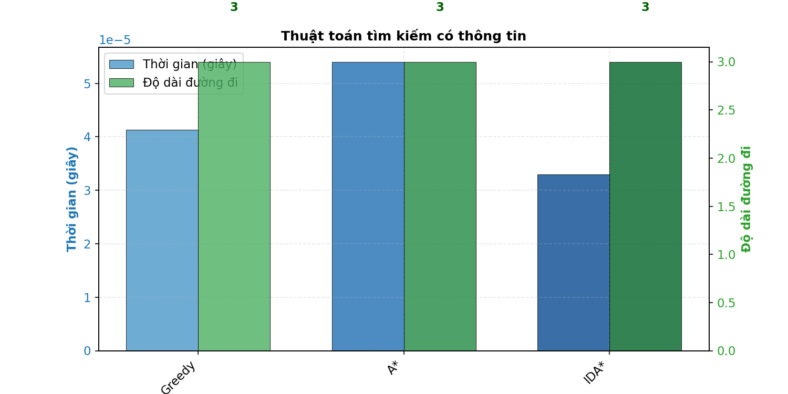
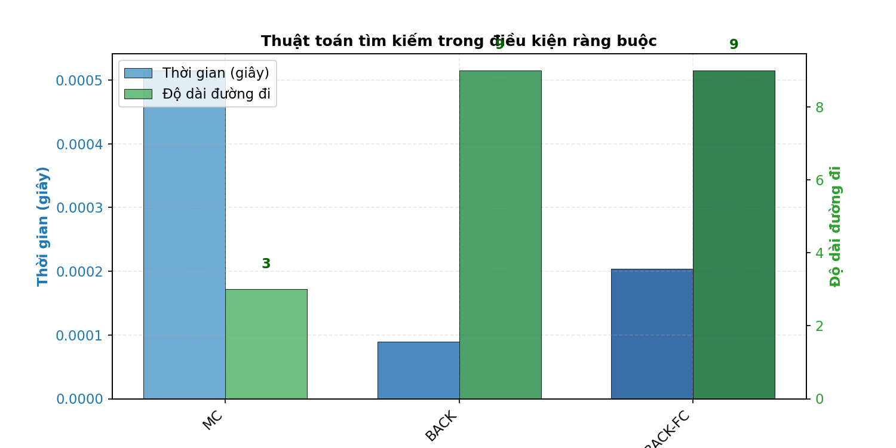

# 8-Puzzle Solver AI
Sinh viên thực hiện: Phan Việt Tuấn - MSSV: 23110355
Báo cáo cá nhân bộ môn Trí Tuệ Nhân Tạo
## Mục tiêu
Xây dựng một hệ thống trực quan hóa và so sánh các thuật toán AI giải bài toán 8-puzzle, bao gồm các nhóm thuật toán tìm kiếm, ràng buộc, học tăng cường và môi trường phức tạp. Dự án giúp sinh viên hiểu rõ bản chất, hiệu suất và ứng dụng của từng thuật toán thông qua giao diện trực quan và các phép đo hiệu suất.

---
## Điều hướng nhanh
- [Thành phần chính của bài toán tìm kiếm](#1-thành-phần-chính-của-bài-toán-tìm-kiếm)
- [Uninformed Search Algorithms](#21-uninformed-search-algorithms)
- [Informed Search Algorithms](#22-informed-search-algorithms)
- [Local Search Algorithms](#23-local-search-algorithms)
- [Complex Environment Search](#24-complex-environment-search)
- [Constraint Satisfaction Problems](#25-constraint-satisfaction-problems-csps)
- [Reinforcement Learning](#26-reinforcement-learning)
- [Kết luận](#3-kết-luận)

---

## Nội dung

### 1. Thành phần chính của bài toán tìm kiếm

- **Trạng thái (State):**  
  Một ma trận 3x3 biểu diễn vị trí các ô số từ 0 đến 8, trong đó 0 là ô trống.  
<pre>
                                    1 2 3
                                    4 0 6
                                    7 5 8
</pre>
- **Hành động (Action):**  
Di chuyển ô trống (0) lên, xuống, trái, phải nếu hợp lệ.

- **Trạng thái khởi đầu (Start):**  
Một trạng thái bất kỳ của bảng, do người dùng nhập hoặc chọn ngẫu nhiên.

- **Trạng thái đích (Goal):**  
Mặc định là:
<pre>
                                    1 2 3
                                    4 5 6
                                    7 8 0
</pre>
- **Solution:**  
Một dãy các trạng thái (hoặc dãy hành động) dẫn từ trạng thái khởi đầu đến trạng thái đích.  
Ví dụ:  [start_state, state_1, state_2, ..., goal_state]

---

## 2. Các nhóm thuật toán

### 2.1. Uninformed Search Algorithms

#### Mô tả
Nhóm thuật toán này không sử dụng bất kỳ thông tin nào về trạng thái đích ngoài việc kiểm tra xem một trạng thái có phải đích hay không. Chúng khám phá không gian trạng thái dựa trên cấu trúc cây tìm kiếm.

#### Thuật toán: **BFS, DFS, UCS, ID**
- **BFS (Breadth-First Search):**  
Tìm kiếm theo chiều rộng, mở rộng tất cả trạng thái ở một độ sâu trước khi sang độ sâu tiếp theo. BFS đảm bảo tìm được lời giải ngắn nhất (về số bước) nhưng tốn nhiều bộ nhớ do lưu trữ tất cả trạng thái.
- **DFS (Depth-First Search):**  
Tìm kiếm theo chiều sâu, khám phá một nhánh đến khi không thể tiếp tục thì quay lui. DFS tiết kiệm bộ nhớ nhưng không đảm bảo lời giải ngắn nhất. Trong 8-Puzzle, không gian trạng thái hữu hạn nên không có nhánh vô tận, nhưng DFS có thể thăm nhiều trạng thái trùng lặp nếu không kiểm soát.
- **UCS (Uniform Cost Search):**  
Mở rộng trạng thái có chi phí đường đi thấp nhất (g(n)). Trong 8-Puzzle tiêu chuẩn, tất cả hành động có chi phí bằng nhau (thường là 1), nên UCS hoạt động tương tự BFS, đảm bảo lời giải ngắn nhất.
- **ID (Iterative Deepening):**  
Kết hợp BFS và DFS bằng cách chạy DFS với giới hạn độ sâu tăng dần. ID tiết kiệm bộ nhớ như DFS nhưng vẫn đảm bảo tìm được lời giải ngắn nhất như BFS.

- **Độ phức tạp**
<pre>
                            Độ phức tạp thời gian    Độ phức tạp không gian
BFS                                O(b^d)	                     O(b^d)
DFS                                O(n^m )	                   O(bm)
UCS                                O(b(1 + [C*/ε]))	           O(b^(d + 1))
ID (Iterative Deepening)           O(b^d)	                     O(bd)
</pre>
Trong đó:
b: Số phân nhánh
d: Độ dài giải pháp tối thiểu của không gian trạng thái đã cho
m: Độ sâu tối đa của cây tìm kiếm
n: Số trạng thái trong không gian trạng thái
C*: Chi phí của giải pháp tối ưu
ε: là mỗi bước để tiến gần hơn đến nút đích

**GIF minh họa:**  
*Breadth-First Search*
  
*Depth-First Search*
 
*Uniform Cost Search*
  
*Iterative Deepening*

#### So sánh hiệu suất

**Nhận xét:**  
- **BFS:** Đảm bảo tìm lời giải ngắn nhất nhưng tốn bộ nhớ với không gian trạng thái lớn (O(b^d)).
- **DFS:** Tiết kiệm bộ nhớ (O(bm)) nhưng có thể thăm nhiều trạng thái trùng lặp nếu không dùng tập hợp trạng thái đã thăm.
- **UCS:** Tương tự BFS, nhưng phù hợp hơn khi chi phí hành động khác nhau.
- **ID:** Kết hợp ưu điểm của BFS và DFS, tiết kiệm bộ nhớ nhưng tốn thời gian do kiểm tra lại trạng thái ở độ sâu thấp.

---

### 2.2. Informed Search Algorithms

#### Mô tả
Nhóm thuật toán này sử dụng hàm heuristic h(n) để ước lượng chi phí từ trạng thái hiện tại đến trạng thái đích, giúp giảm số trạng thái cần khám phá.

#### Thuật toán: **Greedy, A*, IDA*.**
- **Greedy Best-First Search:**  
Chọn trạng thái có giá trị heuristic h(n) nhỏ nhất (không tính chi phí đường đi g(n)). Nhanh nhưng không đảm bảo lời giải tối ưu do không xem xét chi phí thực tế.
- **A* Search:**  
Kết hợp chi phí đường đi g(n) và heuristic h(n) qua hàm đánh giá f(n) = g(n) + h(n). A* đảm bảo lời giải tối ưu nếu h(n) là admissible (không ước lượng quá chi phí thực tế) và consistent (h(n) ≤ c(n, n') + h(n') cho mọi trạng thái n, n' và chi phí c(n, n')).
- **IDA* (Iterative Deepening A*):**  
Kết hợp A* với iterative deepening, giới hạn giá trị f(n) tăng dần. IDA* tiết kiệm bộ nhớ hơn A* nhưng có thể kiểm tra lại trạng thái.

- **Độ phức tạp**
<pre>
                            Độ phức tạp thời gian    Độ phức tạp không gian
Greedy                              O(b^m)	                  O(b^m)
A*                                  O(b^m)	                  O(b^m)
IDA*                                O(b^d)	                  O(lB)
</pre>

Trong đó:
b: Số nhánh của cây/đồ thị
m: Độ sâu của cây/đồ thị khi tìm ra Solution
l: Chiều dài của path được tạo dài nhất
B: Số nhánh

**GIF minh họa:**  
*Greedy Best-First Search:*
  
*A_Star Search:*
  
*IDA_Star (Iterative Deepening A_star):*

#### So sánh hiệu suất

#### Nhận xét
- **Greedy:** Nhanh nhưng không đảm bảo tìm được lời giải tối ưu do chỉ dựa vào h(n).
- **A*:** Đảm bảo tìm được lời giải tối ưu nhờ heuristic admissible và consistent, hiệu quả nhất trong 8-Puzzle.
- **IDA*:** Tiết kiệm bộ nhớ hơn A* nhưng có thể chậm hơn do kiểm tra lại trạng thái.

---

### 2.3. Local Search Algorithms

#### Mô tả
Các thuật toán này duy trì một hoặc một số trạng thái hiện tại và di chuyển đến các trạng thái lân cận tốt hơn dựa trên hàm mục tiêu. Thường dùng cho các bài toán tối ưu hóa hơn là tìm đường đi.

#### Thuật toán: **Simple HC, Steepest HC, Stochastic HC, SA, Beam, Genetic**
- **Simple Hill Climbing:**  
Chọn trạng thái lân cận đầu tiên tốt hơn trạng thái hiện tại. Dễ kẹt tại cực trị cục bộ.
- **Steepest Ascent Hill Climbing:**  
Chọn trạng thái lân cận tốt nhất trong tất cả lân cận. Vẫn có nguy cơ kẹt tại cực trị cục bộ.
- **Stochastic Hill Climbing:**  
Chọn ngẫu nhiên một trạng thái lân cận tốt hơn, giảm nguy cơ kẹt cục bộ.
- **Simulated Annealing:**  
Chấp nhận trạng thái xấu hơn với xác suất giảm dần theo thời gian, giúp thoát cực trị cục bộ.
- **Beam Search:**  
Duy trì một số lượng trạng thái tốt nhất (beam width) tại mỗi bước, cân bằng giữa tốc độ và chất lượng lời giải.
- **Genetic Algorithm:**  
Sử dụng quần thể trạng thái (chromosomes), áp dụng crossover (kết hợp hai trạng thái) và mutation (hoán đổi ngẫu nhiên các ô) để tiến hóa lời giải.

**GIF minh họa:**  
*Simple Hill Climbing:*
  
*Steepest Ascent Hill Climbing:*
  
*Stochastic Hill Climbing:*
  
*Simulated Annealing:*
  
*Beam Search:*
  
*Genetic Algorithm:*

#### So sánh hiệu suất

#### Nhận xét
- **Hill Climbing:** Đơn giản nhưng dễ mắc kẹt tại cực trị cục bộ
- **Simulated Annealing:** Có khả năng thoát khỏi cực trị cục bộ, phù hợp với không gian tìm kiếm phức tạp
- **Beam Search:** Cân bằng giữa tốc độ và khả năng tìm lời giải tốt
- **Genetic Algorithm:** Mạnh mẽ với không gian tìm kiếm lớn, phức tạp, nhưng tốn nhiều tài nguyên

---

### 2.4. Complex Environment Search

#### Mô tả
Nhóm thuật toán này xử lý các bài toán trong môi trường không xác định, quan sát một phần hoặc đa mục tiêu. Trong 8-Puzzle, chúng được mô phỏng để minh họa thách thức của môi trường thực tế.

#### Thuật toán: **AND-OR, Belief State, PO**
- **AND-OR Search:**  
Dùng cho bài toán có nhiều mục tiêu phụ hoặc môi trường không xác định. Trong 8-Puzzle, có thể mô phỏng bằng cách xem một số trạng thái trung gian là mục tiêu phụ.
- **Belief State:**  
Mô hình hóa tập hợp trạng thái có thể xảy ra dựa trên thông tin quan sát. Trong 8-Puzzle, có thể giả định chỉ một phần trạng thái được quan sát.
- **PO (Partially Observable):**  
Xử lý môi trường chỉ quan sát được một phần trạng thái, ví dụ: chỉ thấy vị trí ô trống.

**GIF minh họa:**  
*AND-OR Search:*
  
*Belief State:*
  
*PO (Partially Observable):*

#### So sánh hiệu suất

**Nhận xét:**  
- **AND-OR:** Phù hợp khi 8-Puzzle được mở rộng với nhiều mục tiêu phụ, nhưng ít hiệu quả trong trường hợp tiêu chuẩn.
- **Belief State:** Xử lý tốt trường hợp không chắc chắn về trạng thái, nhưng tăng độ phức tạp tính toán.
- **PO:** Hiệu suất giảm mạnh khi thông tin quan sát hạn chế, minh họa thách thức của môi trường thực tế.

---

### 2.5. Constraint Satisfaction Problems (CSPs)

#### Mô tả
Cách tiếp cận CSP xem 8-puzzle như bài toán gán giá trị cho các biến sao cho thỏa mãn các ràng buộc:

Biến: 9 ô trên lưới.
Miền giá trị: Các số từ 0 đến 8, không lặp lại.
Ràng buộc: Mỗi ô có giá trị duy nhất, và trạng thái phải khả nghiệm (số phép đảo chẵn).

#### Thuật toán: **MC (Min-Conflicts), BACK, BACK-FC**
- **Min-Conflicts:**  
Khởi tạo một trạng thái đầy đủ, sau đó chọn ô xung đột và gán giá trị giảm xung đột nhất. Hiệu quả với CSP lớn, nhưng trong 8-Puzzle có thể kẹt tại trạng thái không tối ưu.
- **Backtracking:**  
Gán giá trị cho từng ô, quay lui khi gặp xung đột. Đơn giản nhưng kém hiệu quả với không gian trạng thái lớn.
- **Backtracking with Forward Checking:**  
Kết hợp backtracking với kiểm tra trước miền giá trị khả thi, cắt tỉa sớm các nhánh không khả thi.

**GIF minh họa:**  
*Min-Conflicts:*
  
*Backtracking:*

*Backtracking with Forward Checking:*

#### So sánh hiệu suất

**Nhận xét:**  
- **Min-Conflicts:** Hiệu quả với CSP lớn, nhưng trong 8-Puzzle có thể không tối ưu do không gian trạng thái nhỏ.
- **Backtracking:** Đơn giản nhưng kém hiệu quả với bài toán lớn.
- **Backtracking with Forward Checking:** Cải thiện backtracking bằng cách loại bỏ sớm giá trị không khả thi

---

### 2.6. Reinforcement Learning

#### Mô tả
Phương pháp học từ tương tác với môi trường, thông qua hệ thống thưởng phạt.

#### Thuật toán: **Q-Learning**
- **Q-Learning:**  
Học chính sách giải quyết bài toán thông qua thử nghiệm và phần thưởng.  
Q-table lưu giá trị Q cho từng trạng thái và hành động, cập nhật dần qua các tập huấn luyện.

**GIF minh họa:** 
*Q-Learning:* 

#### So sánh hiệu suất

**Nhận xét:**  
- Cần thời gian huấn luyện dài để hội tụ đến chính sách tối ưu
- Hiệu quả phụ thuộc vào tham số alpha (tốc độ học), gamma (chiết khấu), và epsilon (khám phá)
- Phù hợp với môi trường thay đổi, nhưng kém hiệu quả hơn A* trong 8-Puzzle tiêu chuẩn.

---

### So sánh tổng hợp
**Các thuật toán được thử nghiệm với trạng thái khởi đầu [[1, 2, 3], [4, 0, 6], [7, 5, 8]] và một số trạng thái phức tạp hơn (có nhiều phép đảo) để đánh giá hiệu suất thực tế.**

## 3. Kết luận

### Kết quả đạt được
- Xây dựng thành công hệ thống trình diễn 20 thuật toán AI trên bài toán 8-Puzzle.
- Trực quan hóa quá trình giải quyết của từng thuật toán bằng GIF và biểu đồ.
- So sánh khách quan hiệu suất giữa các thuật toán dựa trên thời gian chạy và độ dài đường đi.

### Nhận xét tổng quát
- Thuật toán **A*** cho hiệu quả tốt nhất về cả thời gian và độ dài lời giải
- Các thuật toán **Local Search** minh họa rõ vấn đề của cực trị cục bộ
- **Reinforcement Learning** cho thấy tiềm năng học từ tương tác nhưng cần nhiều thời gian
- **Complex Environment** làm nổi bật thách thức của thế giới thực khi thông tin không đầy đủ

### Hạn chế và hướng phát triển
- Cải thiện hiệu suất của các thuật toán với bảng kích thước lớn hơn (15-puzzle)
- Thêm các thuật toán học máy hiện đại hơn như Deep Q-Network
- Phát triển môi trường mô phỏng thách thức hơn (nhiễu, ràng buộc thời gian thực).
- Phát triển môi trường mô phỏng thách thức hơn (nhiễu, ràng buộc thời gian thực)

---
