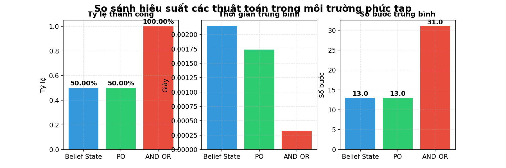
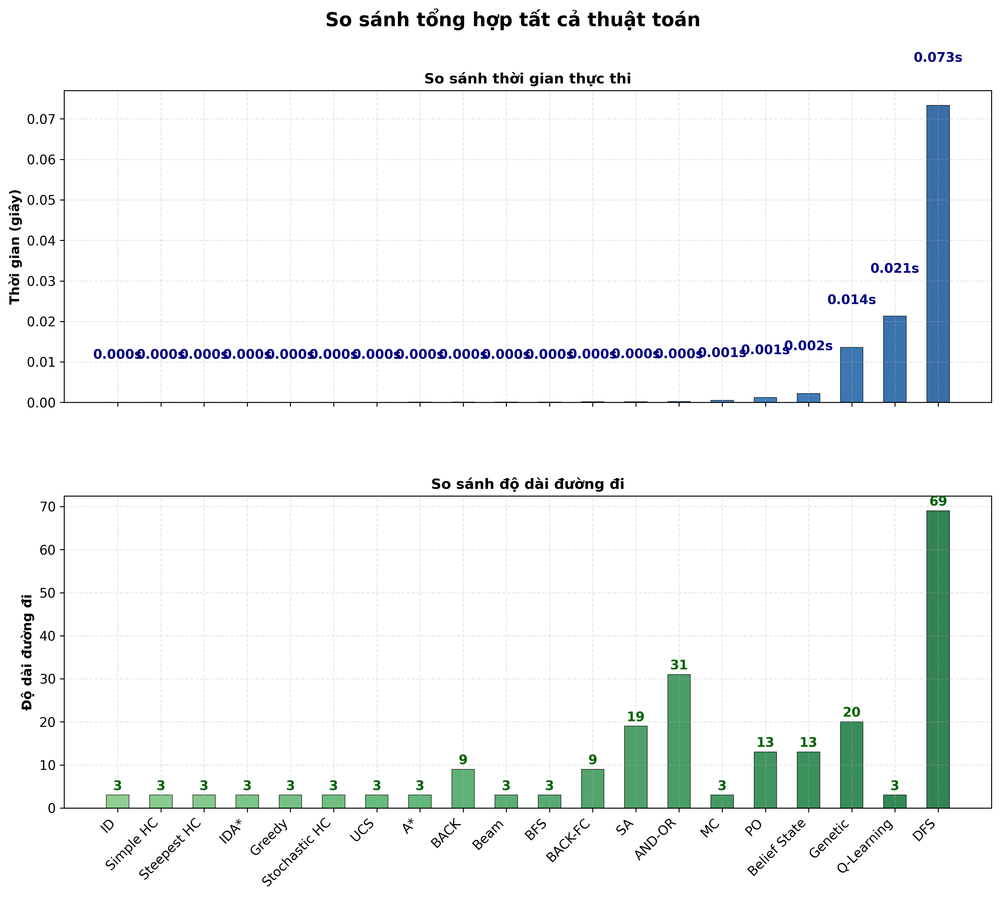
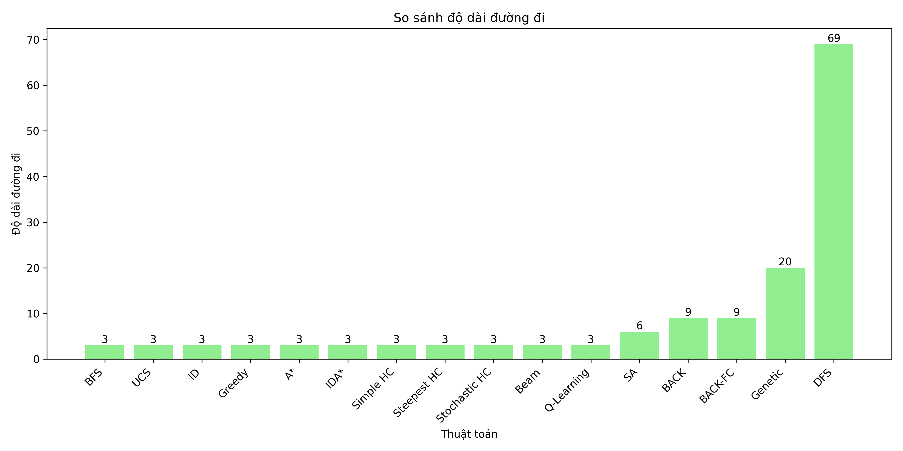

# 8-Puzzle Solver AI
Sinh viên thực hiện: Phan Việt Tuấn  
MSSV: 23110355  
Báo cáo đồ án cá nhân bộ môn Trí Tuệ Nhân Tạo

---
## Mục lục
- [1. Mục tiêu](#1-mục-tiêu)
- [2. Nội dung](#2-nội-dung)
  - [2.1 Các thuật toán tìm kiếm không có thông tin](#21-các-thuật-toán-tìm-kiếm-không-có-thông-tin)
  - [2.2 Các thuật toán tìm kiếm có thông tin](#22-các-thuật-toán-tìm-kiếm-có-thông-tin)
  - [2.3 Các thuật toán Local Search](#23-các-thuật-toán-local-search)
  - [2.4 Các thuật toán tìm kiếm ở môi trường phức tạp](#24-các-thuật-toán-tìm-kiếm-ở-môi-trường-phức-tạp)
  - [2.5 Các thuật toán Constraint Satisfaction Problems (CSPs)](#25-các-thuật-toán-constraint-satisfaction-problems-csps)
  - [2.6 Các thuật toán Reinforcement Learning](#26-các-thuật-toán-reinforcement-learning)
- [3. Kết luận](#3-kết-luận)
  - [3.1 Kết quả đạt được](#31-kết-quả-đạt-được)
  - [3.2 Hướng phát triển](#32-hướng-phát-triển)
---

# 1. Mục tiêu
Xây dựng một hệ thống trực quan hóa và so sánh các thuật toán AI giải bài toán 8-puzzle, bao gồm các nhóm thuật toán tìm kiếm, ràng buộc, học tăng cường và môi trường phức tạp. Dự án giúp sinh viên hiểu rõ bản chất, hiệu suất và ứng dụng của từng thuật toán thông qua giao diện trực quan và các phép đo hiệu suất.

---

# 2. Nội dung

## 2.1 Các thuật toán tìm kiếm không có thông tin
Nhóm thuật toán tìm kiếm không có thông tin (uninformed search) là các phương pháp tìm kiếm không sử dụng bất kỳ thông tin nào về khoảng cách đến trạng thái đích, chỉ dựa vào cấu trúc không gian trạng thái. Các thuật toán này như BFS, DFS, ID, UCS thường đảm bảo tìm được lời giải nếu tồn tại, nhưng có thể tốn nhiều thời gian và bộ nhớ khi không gian trạng thái lớn.

### 2.1.1 Thuật toán BFS (Breadth-First Search)
BFS được dùng để giải bài toán 8-puzzle bằng cách tìm kiếm theo chiều rộng trên không gian trạng thái. Thuật toán duyệt từng lớp các trạng thái, bắt đầu từ trạng thái ban đầu, mở rộng tất cả các trạng thái kề bằng cách di chuyển ô trống (0) lên/xuống/trái/phải. Mỗi trạng thái được lưu cùng đường đi đã thực hiện. BFS đảm bảo tìm được lời giải ngắn nhất (ít bước nhất) nếu tồn tại, nhờ sử dụng hàng đợi (queue) và tập hợp các trạng thái đã thăm để tránh lặp lại.

**Gif minh họa:**  

### 2.1.2 Thuật toán DFS (Depth-First Search)
Thuật toán DFS là thuật toán tìm kiếm theo chiều sâu, ưu tiên đi sâu vào từng nhánh trước khi quay lại các nhánh khác. Trong 8-Puzzle, DFS sử dụng stack để lưu các trạng thái, mỗi lần sẽ di chuyển ô trống theo các hướng hợp lệ và tiếp tục mở rộng đến khi gặp trạng thái đích hoặc đạt giới hạn độ sâu. Để tránh lặp vô hạn, thuật toán có kiểm soát độ sâu và đánh dấu trạng thái đã thăm ở từng mức.

**Gif minh họa:**  

### 2.1.3 Thuật toán ID (Iterative Deepening)
Thuật toán ID là sự kết hợp giữa DFS và BFS. Ý tưởng là thực hiện DFS nhiều lần với giới hạn độ sâu tăng dần, bắt đầu từ 0, 1, 2,... cho đến khi tìm thấy lời giải hoặc đạt giới hạn. Ở mỗi lần lặp, thuật toán sẽ tìm kiếm theo chiều sâu nhưng không vượt quá độ sâu hiện tại. Nhờ đó, ID vừa tiết kiệm bộ nhớ như DFS, vừa đảm bảo tìm được lời giải ngắn nhất như BFS.

**Gif minh họa:**  

### 2.1.4 Thuật toán UCS (Uniform Cost Search)
Thuật toán UCS là một biến thể của BFS nhưng có xét đến chi phí đường đi. UCS sử dụng hàng đợi ưu tiên (priority queue), luôn mở rộng trạng thái có tổng chi phí nhỏ nhất từ trạng thái ban đầu đến trạng thái hiện tại. Trong 8-Puzzle, mỗi bước di chuyển thường có chi phí bằng nhau nên UCS sẽ tìm được lời giải ngắn nhất giống như BFS.

**Gif minh họa:**  

### So sánh hiệu suất của các thuật toán tìm kiếm không có thông tin

**Nhận xét:**  
- **BFS:** Đảm bảo tìm lời giải ngắn nhất nhưng tốn bộ nhớ với không gian trạng thái lớn (O(b^d)).
- **DFS:** Tiết kiệm bộ nhớ (O(bm)) nhưng có thể thăm nhiều trạng thái trùng lặp nếu không dùng tập hợp trạng thái đã thăm.
- **UCS:** Tương tự BFS, nhưng phù hợp hơn khi chi phí hành động khác nhau.
- **ID:** Kết hợp ưu điểm của BFS và DFS, tiết kiệm bộ nhớ nhưng tốn thời gian do kiểm tra lại trạng thái ở độ sâu thấp.

## 2.2 Các thuật toán tìm kiếm có thông tin
Nhóm thuật toán tìm kiếm có thông tin (informed search) sử dụng các hàm heuristic để ước lượng chi phí còn lại đến trạng thái đích, giúp quá trình tìm kiếm hiệu quả hơn. Các thuật toán như A*, IDA*, Greedy thường tìm được lời giải nhanh hơn và tối ưu hơn so với các thuật toán không có thông tin, đặc biệt khi heuristic tốt.

### 2.2.1 Thuật toán Greedy Best-First Search
Thuật toán Greedy (tìm kiếm tham lam) sử dụng giá trị heuristic để quyết định mở rộng trạng thái nào tiếp theo, mà không quan tâm đến chi phí đã đi. Trong 8-Puzzle, heuristic thường dùng là tổng khoảng cách Manhattan của các ô về đúng vị trí. Greedy luôn chọn trạng thái có heuristic nhỏ nhất để mở rộng trước, với mục tiêu tiến nhanh nhất về đích.

**Gif minh họa:**  

### 2.2.2 Thuật toán A* Search
Thuật toán A* là thuật toán tìm kiếm có thông tin, kết hợp giữa chi phí thực (g) từ trạng thái ban đầu đến trạng thái hiện tại và giá trị heuristic (h) ước lượng chi phí còn lại đến đích. A* sử dụng hàng đợi ưu tiên, luôn mở rộng trạng thái có tổng chi phí f = g + h nhỏ nhất. Nhờ đó, A* thường tìm được lời giải ngắn nhất với tốc độ nhanh hơn BFS/UCS khi heuristic tốt.

**Gif minh họa:**  

### 2.2.3 Thuật toán IDA* (Iterative Deepening A*)
Thuật toán IDA* là sự kết hợp giữa A* và tìm kiếm lặp sâu dần. IDA* sử dụng giá trị f = g + h (g là chi phí thực, h là heuristic) làm ngưỡng cắt, sau đó thực hiện tìm kiếm theo chiều sâu nhưng không vượt quá ngưỡng này. Nếu không tìm thấy lời giải, thuật toán sẽ tăng ngưỡng lên giá trị nhỏ nhất lớn hơn ngưỡng cũ và lặp lại quá trình.

**Gif minh họa:**  

### So sánh hiệu suất của các thuật toán tìm kiếm có thông tin

**Nhận xét:**  
- **Greedy:** Nhanh nhưng không đảm bảo tìm được lời giải tối ưu
- **A*:** Đảm bảo tìm được lời giải tối ưu nếu hàm heuristic chấp nhận được
- **IDA*:** Tiết kiệm bộ nhớ hơn A* nhưng có thể phải kiểm tra lại nhiều trạng thái

## 2.3 Các thuật toán Local Search
Nhóm thuật toán Local Search tập trung vào việc cải thiện dần lời giải hiện tại bằng cách chỉ xét các trạng thái lân cận. Các thuật toán như Beam Search, Hill Climbing, Simulated Annealing, Genetic Algorithm phù hợp cho các bài toán có không gian trạng thái lớn, nhưng có thể bị kẹt ở điểm cực trị cục bộ.

### 2.3.1 Thuật toán Simple Hill Climbing
Thuật toán Simple Hill Climbing là một phương pháp tìm kiếm địa phương, luôn chọn trạng thái kề có giá trị heuristic tốt hơn hiện tại. Quá trình lặp lại cho đến khi không còn trạng thái nào tốt hơn, khi đó thuật toán có thể mắc kẹt tại điểm cực trị cục bộ. Ưu điểm là thuật toán đơn giản, tốc độ nhanh, nhưng nhược điểm là dễ bị kẹt.

**Gif minh họa:**  

### 2.3.2 Thuật toán Steepest Ascent Hill Climbing
Thuật toán Steepest Ascent Hill Climbing là một biến thể của Hill Climbing, ở mỗi bước sẽ xét tất cả các trạng thái kề và chọn trạng thái có giá trị heuristic tốt nhất để di chuyển. Quá trình lặp lại cho đến khi không còn trạng thái nào tốt hơn, khi đó thuật toán có thể mắc kẹt tại điểm cực trị cục bộ.

**Gif minh họa:**  

### 2.3.3 Thuật toán Stochastic Hill Climbing
Thuật toán Stochastic Hill Climbing là một biến thể của Hill Climbing, thay vì luôn chọn trạng thái kề tốt nhất, thuật toán sẽ chọn ngẫu nhiên một trạng thái kề có giá trị heuristic tốt hơn hoặc bằng hiện tại để di chuyển. Quá trình này giúp tránh bị kẹt ở một số điểm cực trị cục bộ.

**Gif minh họa:**  

### 2.3.4 Thuật toán Simulated Annealing
Thuật toán Simulated Annealing mô phỏng quá trình tôi luyện kim loại, cho phép nhận các trạng thái kém hơn với xác suất giảm dần theo nhiệt độ. Ở mỗi bước, thuật toán chọn ngẫu nhiên một trạng thái kề, nếu tốt hơn thì nhận luôn, nếu kém hơn thì vẫn có thể nhận dựa trên xác suất.

**Gif minh họa:**  

### 2.3.5 Thuật toán Beam Search
Thuật toán Beam Search là một biến thể của tìm kiếm theo chiều rộng có giới hạn số lượng trạng thái được mở rộng ở mỗi mức (gọi là beam width). Ở mỗi bước, thuật toán chỉ giữ lại một số trạng thái tốt nhất dựa trên giá trị heuristic, các trạng thái còn lại sẽ bị loại bỏ.

**Gif minh họa:**  

### 2.3.6 Thuật toán Genetic Algorithm
Thuật toán Genetic Algorithm (di truyền) mô phỏng quá trình tiến hóa tự nhiên để tìm lời giải. Mỗi cá thể trong quần thể là một trạng thái của trò chơi. Thuật toán bắt đầu với một quần thể ngẫu nhiên, sau đó lặp lại các bước: đánh giá độ thích nghi, chọn lọc, lai ghép và đột biến để tạo ra thế hệ mới.

**Gif minh họa:**  

### So sánh hiệu suất của các thuật toán Local Search

**Nhận xét:**  
- **Hill Climbing:** Đơn giản nhưng dễ mắc kẹt tại cực trị cục bộ
- **Simulated Annealing:** Có khả năng thoát khỏi cực trị cục bộ, phù hợp với không gian tìm kiếm phức tạp
- **Beam Search:** Cân bằng giữa tốc độ và khả năng tìm lời giải tốt
- **Genetic Algorithm:** Mạnh mẽ với không gian tìm kiếm lớn, phức tạp, nhưng tốn nhiều tài nguyên

## 2.4 Các thuật toán tìm kiếm ở môi trường phức tạp
Nhóm thuật toán này được thiết kế để giải quyết các bài toán trong môi trường không chắc chắn hoặc không quan sát đầy đủ. Các phương pháp như Searching with Partially Observable, AND-OR Search, Belief State Search giúp xử lý các trường hợp trạng thái ban đầu không rõ ràng hoặc có nhiều khả năng xảy ra.

### 2.4.1 Thuật toán AND-OR Search
Thuật toán AND-OR Search được sử dụng để giải các bài toán có tính không xác định hoặc môi trường phức tạp, nơi mỗi hành động có thể dẫn đến nhiều kết quả khác nhau. Trong 8-Puzzle, AND-OR Search xây dựng cây tìm kiếm với các nút OR (chọn một hành động) và các nút AND (xét tất cả kết quả có thể của một hành động).

**Gif minh họa:**  

### 2.4.2 Thuật toán Belief State Search
Thuật toán Belief State Search được sử dụng khi trạng thái ban đầu không xác định chính xác mà chỉ biết tập hợp các trạng thái có thể (belief states). Thuật toán sẽ duy trì và mở rộng song song nhiều trạng thái khởi đầu, mỗi bước sẽ xét tất cả các trạng thái trong tập belief và mở rộng chúng theo các hành động hợp lệ.

**Gif minh họa:**  

### 2.4.3 Thuật toán PO (Partially Observable)
Thuật toán Partially Observable áp dụng cho trường hợp trạng thái ban đầu của 8-Puzzle không được quan sát đầy đủ, chỉ biết một phần vị trí các ô. Thuật toán sẽ sinh ra tất cả các trạng thái ban đầu có thể dựa trên thông tin quan sát được, sau đó thực hiện tìm kiếm lời giải cho từng trạng thái này.

**Gif minh họa:**  

### So sánh hiệu suất của các thuật toán tìm kiếm ở môi trường phức tạp

**Hiệu suất chi tiết từng thuật toán:**
- **Belief State Search:**  
  
- **Partially Observable Search:**  
  
- **AND-OR Search:**  
  

**Nhận xét:**  
- **AND-OR:** Phù hợp khi 8-Puzzle được mở rộng với nhiều mục tiêu phụ, nhưng ít hiệu quả trong trường hợp tiêu chuẩn.
- **Belief State:** Xử lý tốt trường hợp không chắc chắn về trạng thái, nhưng tăng độ phức tạp tính toán.
- **PO:** Hiệu suất giảm mạnh khi thông tin quan sát hạn chế, minh họa thách thức của môi trường thực tế.

## 2.5 Các thuật toán Constraint Satisfaction Problems (CSPs)
Cách tiếp cận CSP xem 8-puzzle như bài toán gán giá trị cho các biến sao cho thỏa mãn các ràng buộc. Các thuật toán như Backtracking Search, Min-Conflicts Search thường được dùng cho các bài toán như xếp lịch, sudoku, và có thể áp dụng cho 8-Puzzle.

### 2.5.1 Thuật toán Min-Conflicts (MC)
Thuật toán Min-Conflicts là một phương pháp giải bài toán ràng buộc (CSP), hoạt động bằng cách luôn chọn nước đi làm giảm số lượng xung đột nhiều nhất ở mỗi bước. Trong 8-Puzzle, xung đột thường được tính là số ô chưa đúng vị trí so với trạng thái đích. Thuật toán sẽ lặp lại quá trình chọn và thực hiện nước đi ít xung đột nhất cho đến khi đạt trạng thái đích.

**Gif minh họa:**  

### 2.5.2 Thuật toán Backtracking (BACK)
Thuật toán Backtracking Search (tìm kiếm quay lui) thử điền từng giá trị vào các ô của bảng 8-Puzzle theo thứ tự, mỗi lần điền sẽ kiểm tra tính hợp lệ. Nếu gặp trường hợp không thể tiếp tục, thuật toán sẽ quay lui để thử giá trị khác. Quá trình này lặp lại cho đến khi tìm được trạng thái thỏa mãn điều kiện đích.

**Gif minh họa:**  

### 2.5.3 Thuật toán Backtracking with Forward Checking (BACK-FC)
Thuật toán Backtracking with Forward Checking kết hợp backtracking với kiểm tra trước miền giá trị khả thi, cắt tỉa sớm các nhánh không khả thi. Khi một giá trị được gán cho một biến, thuật toán cập nhật miền giá trị hợp lệ của các biến chưa gán, giúp tránh được nhiều trường hợp không cần thiết.

**Gif minh họa:**  

### So sánh hiệu suất của các thuật toán CSPs

**Nhận xét:**  
- **Min-Conflicts:** Hiệu quả với CSP lớn, nhưng trong 8-Puzzle có thể không tối ưu do không gian trạng thái nhỏ.
- **Backtracking:** Đơn giản nhưng kém hiệu quả với bài toán lớn.
- **Backtracking with Forward Checking:** Cải thiện backtracking bằng cách loại bỏ sớm giá trị không khả thi

## 2.6 Các thuật toán Reinforcement Learning
Nhóm thuật toán Reinforcement Learning (học tăng cường) giúp tác nhân học cách hành động tối ưu thông qua tương tác với môi trường và nhận phần thưởng.

### 2.6.1 Thuật toán Q-Learning
Thuật toán Q-Learning là một phương pháp học tăng cường không cần mô hình môi trường. Trong 8-Puzzle, mỗi trạng thái là một trạng thái của bàn cờ, mỗi hành động là một nước đi hợp lệ của ô trống. Q-Learning sẽ cập nhật bảng Q-value cho từng cặp (trạng thái, hành động) dựa trên phần thưởng nhận được sau mỗi bước đi, với mục tiêu tối đa hóa tổng phần thưởng về sau.

**Gif minh họa:**  

### So sánh hiệu suất của các thuật toán Reinforcement Learning

**Nhận xét:**  
- Cần thời gian huấn luyện dài để hội tụ đến chính sách tối ưu
- Hiệu quả phụ thuộc vào tham số alpha (tốc độ học), gamma (chiết khấu), và epsilon (khám phá)
- Có khả năng thích ứng với môi trường thay đổi

### So sánh tổng hợp

**Cách đo benchmark và thu thập số liệu:**  
Để so sánh hiệu suất giữa các thuật toán, project thực hiện các bước sau:

- **Chọn cùng một trạng thái khởi đầu** cho tất cả các thuật toán ([[1, 2, 3], [4, 0, 6], [7, 5, 8]] hoặc các trạng thái khó hơn).
- **Chạy từng thuật toán** giải bài toán 8-puzzle với trạng thái này, mỗi thuật toán được thực thi nhiều lần để lấy kết quả trung bình (nếu thuật toán có yếu tố ngẫu nhiên).
- **Đo thời gian thực thi**: Sử dụng hàm time hoặc datetime để lấy thời gian bắt đầu và kết thúc khi giải xong, tính ra thời gian chạy (tính bằng giây hoặc mili giây).
- **Đếm số bước đi (path length)**: Đếm số bước di chuyển từ trạng thái đầu đến trạng thái đích trong lời giải tìm được.
- **Đếm số node mở rộng**: Mỗi lần thuật toán sinh ra một trạng thái mới (mở rộng node), biến đếm sẽ tăng lên. Điều này giúp đánh giá mức độ "tốn công" của thuật toán.
- **Đo bộ nhớ sử dụng** (nếu có): Một số thuật toán như BFS, A* sẽ lưu lại số lượng trạng thái trong hàng đợi hoặc tập đã thăm, từ đó có thể ước lượng bộ nhớ tiêu thụ.
- **Tỷ lệ thành công**: Với các thuật toán không đảm bảo hội tụ (ví dụ: Hill Climbing, Genetic), chạy nhiều lần và tính tỷ lệ tìm được lời giải.

---
**Nhờ cách đo benchmark này, project đảm bảo việc so sánh giữa các thuật toán là khách quan, công bằng và có ý nghĩa thực tiễn khi áp dụng vào bài toán 8-puzzle.**
- **So sánh tổng hợp tất cả thuật toán:**  
  
- **So sánh thời gian thực thi:**  
  
- **So sánh độ dài đường đi:**  
  

---

# 3. Kết luận

## 3.1 Kết quả đạt được
- Xây dựng thành công game áp dụng 20 thuật toán AI trên cùng một bài toán 8 ô puzzle
- Trực quan hóa quá trình giải quyết của từng thuật toán
- So sánh khách quan hiệu suất giữa các thuật toán

Quá trình thực hiện project đã giúp hiểu rõ hơn về cách hoạt động của nhiều thuật toán trí tuệ nhân tạo khi giải quyết bài toán 8-Puzzle. Đã áp dụng và so sánh các nhóm thuật toán như tìm kiếm không có thông tin, tìm kiếm có thông tin, local search, tìm kiếm trong môi trường phức tạp, constraint satisfaction problems và reinforcement learning trên cùng một bài toán cụ thể.

Kết quả thực nghiệm cho thấy các thuật toán như BFS, UCS, A*, IDA* thường tìm được lời giải ngắn nhất và ổn định, trong khi các thuật toán như DFS, Greedy hoặc Hill Climbing có thể cho kết quả nhanh nhưng không phải lúc nào cũng tối ưu.

## 3.2 Hướng phát triển
- Cải thiện hiệu suất của các thuật toán với bảng kích thước lớn hơn (15-puzzle)
- Thêm các thuật toán học máy hiện đại hơn như Deep Q-Network
- Phát triển môi trường mô phỏng thách thức hơn (nhiễu, ràng buộc thời gian thực).
- Phát triển môi trường mô phỏng thách thức hơn (nhiễu, ràng buộc thời gian thực)
- Tối ưu hóa bộ nhớ và cải thiện hiệu năng
- Bổ sung các chức năng so sánh, trực quan hóa kết quả chi tiết hơn

Trong tương lai, project có thể được mở rộng để giải các biến thể lớn hơn như 15-Puzzle hoặc 24-Puzzle nhằm đánh giá hiệu quả của các thuật toán trên không gian trạng thái phức tạp hơn.