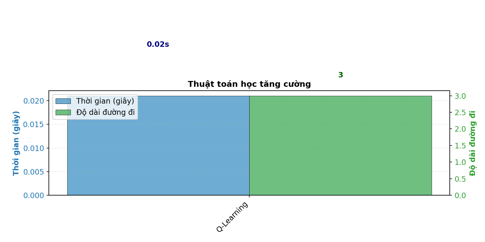

# 8-Puzzle Solver AI

## Mục tiêu
Xây dựng một hệ thống trực quan hóa và so sánh các thuật toán AI giải bài toán 8-puzzle, bao gồm các nhóm thuật toán tìm kiếm, ràng buộc, học tăng cường và môi trường phức tạp. Dự án giúp sinh viên hiểu rõ bản chất, hiệu suất và ứng dụng của từng thuật toán thông qua giao diện trực quan và các phép đo hiệu suất.

---

## Nội dung

### 1. Thành phần chính của bài toán tìm kiếm

- **Trạng thái (State):**  
  Một ma trận 3x3 biểu diễn vị trí các ô số từ 0 đến 8, trong đó 0 là ô trống.  
  Ví dụ:
                                1 2 3
                                4 0 6
                                7 5 8
  
- **Hành động (Action):**  
Di chuyển ô trống (0) lên, xuống, trái, phải nếu hợp lệ.

- **Trạng thái khởi đầu (Start):**  
Một trạng thái bất kỳ của bảng, do người dùng nhập hoặc chọn ngẫu nhiên.

- **Trạng thái đích (Goal):**  
Mặc định là:
                                1 2 3
                                4 5 6
                                7 8 0

- **Solution:**  
Một dãy các trạng thái (hoặc dãy hành động) dẫn từ trạng thái khởi đầu đến trạng thái đích.  
Ví dụ:  [start_state, state_1, state_2, ..., goal_state]

---

## 2. Các nhóm thuật toán

### 2.1. Uninformed Search Algorithms
#### Thuật toán: **BFS, DFS, UCS, ID**
- **BFS (Breadth-First Search):**  
Tìm kiếm theo chiều rộng, đảm bảo tìm được lời giải ngắn nhất nhưng tốn nhiều bộ nhớ.
- **DFS (Depth-First Search):**  
Tìm kiếm theo chiều sâu, tiết kiệm bộ nhớ nhưng dễ rơi vào vòng lặp hoặc nhánh sâu vô tận.
- **UCS (Uniform Cost Search):**  
Tìm kiếm theo chi phí, luôn mở rộng trạng thái có chi phí thấp nhất.
- **ID (Iterative Deepening):**  
Kết hợp ưu điểm của DFS và BFS, tăng dần giới hạn độ sâu.

**GIF minh họa:**  
  
  
  

**So sánh hiệu suất:**  

**Nhận xét:**  
- BFS tìm giải pháp ngắn nhất nhưng tốn bộ nhớ.
- DFS nhanh nhưng không đảm bảo tối ưu và dễ lặp.
- UCS tối ưu về chi phí nhưng chậm với không gian lớn.
- ID tiết kiệm bộ nhớ hơn BFS, nhưng vẫn có thể tốn thời gian.

---

### 2.2. Informed Search Algorithms
#### Thuật toán: **Greedy, A*, IDA***
- **Greedy Best-First Search:**  
Luôn chọn trạng thái có heuristic (Manhattan distance) nhỏ nhất, nhanh nhưng không đảm bảo tối ưu.
- **A_Star Search:**  
Kết hợp chi phí thực tế và heuristic, đảm bảo tìm giải pháp tối ưu nếu heuristic chấp nhận được.
- **IDA_star (Iterative Deepening A_star):**  
Kết hợp A* với iterative deepening, tiết kiệm bộ nhớ hơn A*.

**GIF minh họa:**  
  
  

**So sánh hiệu suất:**  

**Nhận xét:**  
- A* thường nhanh và tối ưu nhất.
- Greedy nhanh nhưng không đảm bảo tối ưu.
- IDA* tiết kiệm bộ nhớ hơn A* nhưng có thể lặp lại nhiều trạng thái.

---

### 2.3. Local Search Algorithms
#### Thuật toán: **Simple HC, Steepest HC, Stochastic HC, SA, Beam, Genetic**
- **Simple Hill Climbing:**  
Luôn chọn trạng thái lân cận tốt hơn hiện tại, dễ kẹt tại cực trị cục bộ.
- **Steepest Ascent Hill Climbing:**  
Chọn trạng thái lân cận tốt nhất trong tất cả các lân cận.
- **Stochastic Hill Climbing:**  
Chọn ngẫu nhiên một lân cận tốt hơn hiện tại.
- **Simulated Annealing:**  
Có thể chấp nhận trạng thái xấu hơn với xác suất giảm dần, giúp thoát cực trị cục bộ.
- **Beam Search:**  
Duy trì một số lượng trạng thái tốt nhất tại mỗi bước (beam width).
- **Genetic Algorithm:**  
Sử dụng quần thể, lai ghép, đột biến để tiến hóa lời giải.

**GIF minh họa:**  
  
  
  

**So sánh hiệu suất:**  

**Nhận xét:**  
- Hill Climbing đơn giản nhưng dễ kẹt.
- Simulated Annealing và Genetic có thể thoát cực trị cục bộ.
- Beam Search hiệu quả với beam width phù hợp.

---

### 2.4. Complex Environment Search
#### Thuật toán: **AND-OR, Belief State, PO**
- **AND-OR Search:**  
Dùng cho các bài toán có nhiều mục tiêu phụ hoặc môi trường không xác định.
- **Belief State:**  
Mô hình hóa trạng thái tin tưởng (tập hợp các trạng thái có thể xảy ra).
- **PO (Partially Observable):**  
Mô phỏng môi trường chỉ quan sát được một phần trạng thái, tăng độ khó cho bài toán.

**GIF minh họa:**  
  
  

**So sánh hiệu suất:**  

**Nhận xét:**  
- AND-OR phù hợp cho bài toán có nhiều mục tiêu phụ.
- Belief State và PO mô phỏng tốt môi trường không đầy đủ thông tin, nhưng hiệu suất giảm mạnh khi tỷ lệ quan sát thấp.

---

### 2.5. Constraint Satisfaction Problems (CSPs)
#### Thuật toán: **MC (Min-Conflicts), BACK, BACK-FC**
- **Min-Conflicts:**  
Khởi tạo lời giải đầy đủ, sau đó lặp lại chọn biến xung đột và gán giá trị giảm xung đột nhất. Hiệu quả với CSP lớn, nhưng với 8-puzzle có thể kẹt cực trị cục bộ.
- **Backtracking:**  
Gán giá trị cho từng biến, quay lui khi gặp xung đột.
- **Backtracking with Forward Checking:**  
Kết hợp backtracking với kiểm tra trước miền giá trị khả thi, cắt tỉa sớm các nhánh không khả thi.

**GIF minh họa:**  
  

**So sánh hiệu suất:**  

**Nhận xét:**  
- Min-Conflicts hiệu quả với bài toán CSP lớn, nhưng với 8-puzzle có thể kẹt cực trị cục bộ.
- Backtracking with Forward Checking cắt tỉa tốt hơn backtracking thuần.

---

### 2.6. Reinforcement Learning
#### Thuật toán: **Q-Learning**
- **Q-Learning:**  
Học chính sách giải quyết bài toán thông qua thử nghiệm và phần thưởng.  
Q-table lưu giá trị Q cho từng trạng thái và hành động, cập nhật dần qua các tập huấn luyện.

**GIF minh họa:**  

**So sánh hiệu suất:**  

**Nhận xét:**  
- Q-Learning cần nhiều tập huấn luyện để hội tụ.
- Hiệu quả phụ thuộc vào tham số alpha, gamma, epsilon.

---

## 3. Kết luận

- Dự án đã trực quan hóa và so sánh hiệu suất của hơn 15 thuật toán AI trên cùng một bài toán 8-puzzle.
- Các thuật toán heuristic (A*, IDA*) cho kết quả tốt nhất về thời gian và độ dài lời giải.
- Các thuật toán local search và CSPs minh họa rõ ràng về cực trị cục bộ và vai trò của heuristic.
- Reinforcement Learning cho thấy tiềm năng nhưng cần nhiều thời gian huấn luyện.
- Môi trường phức tạp (PO, Belief State) làm tăng độ khó và giảm hiệu suất rõ rệt.
- Giao diện trực quan giúp sinh viên dễ dàng quan sát, so sánh và hiểu sâu về từng thuật toán.

---

## Điều hướng nhanh
- [Thành phần chính của bài toán tìm kiếm](#1-thành-phần-chính-của-bài-toán-tìm-kiếm)
- [Uninformed Search Algorithms](#21-uninformed-search-algorithms)
- [Informed Search Algorithms](#22-informed-search-algorithms)
- [Local Search Algorithms](#23-local-search-algorithms)
- [Complex Environment Search](#24-complex-environment-search)
- [Constraint Satisfaction Problems](#25-constraint-satisfaction-problems-csps)
- [Reinforcement Learning](#26-reinforcement-learning)
- [Kết luận](#3-kết-luận)

---

> **Lưu ý:**  
> Các hình ảnh, GIF minh họa và biểu đồ hiệu suất cần được bổ sung vào thư mục `assets/` để README hiển thị đầy đủ trên GitHub.
