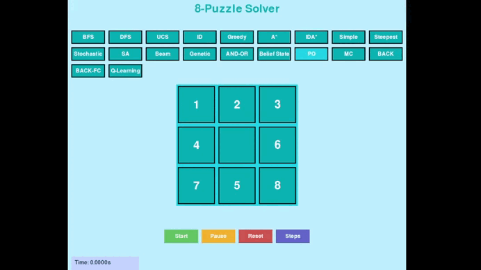

# 8-Puzzle Solver AI

## Mục tiêu
Xây dựng một hệ thống trực quan hóa và so sánh các thuật toán AI giải bài toán 8-puzzle, bao gồm các nhóm thuật toán tìm kiếm, ràng buộc, học tăng cường và môi trường phức tạp. Dự án giúp sinh viên hiểu rõ bản chất, hiệu suất và ứng dụng của từng thuật toán thông qua giao diện trực quan và các phép đo hiệu suất.

---

## Nội dung

### [1. Thành phần chính của bài toán tìm kiếm](#thanh-phan-chinh)
- **Trạng thái (State):** Ma trận 3x3 biểu diễn vị trí các ô số từ 0 đến 8 (0 là ô trống).
- **Hành động (Action):** Di chuyển ô trống lên/xuống/trái/phải.
- **Trạng thái khởi đầu (Start):** Một trạng thái bất kỳ của bảng.
- **Trạng thái đích (Goal):** `[ [1,2,3], [4,5,6], [7,8,0] ]`
- **Solution:** Dãy các trạng thái hoặc hành động dẫn từ trạng thái khởi đầu đến trạng thái đích.

---

## [2. Các nhóm thuật toán](#cac-nhom-thuat-toan)

### [2.1. Uninformed Search Algorithms](#uninformed-search-algorithms)
- **Thuật toán:** BFS, DFS, UCS, ID
- **Mô tả:** Không sử dụng thông tin về trạng thái đích ngoài việc kiểm tra đích.
- **GIF minh họa:**  
    
    
    
  
- **So sánh hiệu suất:**  
  
- **Nhận xét:**  
  - BFS tìm giải pháp ngắn nhất nhưng tốn bộ nhớ.
  - DFS nhanh nhưng dễ rơi vào vòng lặp.
  - UCS tối ưu về chi phí nhưng chậm với không gian lớn.
  - ID kết hợp ưu điểm BFS và DFS nhưng vẫn tốn thời gian.

---

### [2.2. Informed Search Algorithms](#informed-search-algorithms)
- **Thuật toán:** Greedy, A*, IDA*
- **Mô tả:** Sử dụng hàm heuristic (Manhattan) để dẫn hướng tìm kiếm.
- **GIF minh họa:**  
    
    
  
- **So sánh hiệu suất:**  
  
- **Nhận xét:**  
  - A* thường nhanh và tối ưu nhất.
  - Greedy nhanh nhưng không đảm bảo tối ưu.
  - IDA* tiết kiệm bộ nhớ hơn A* nhưng có thể lặp lại nhiều trạng thái.

---

### [2.3. Local Search Algorithms](#local-search-algorithms)
- **Thuật toán:** Simple HC, Steepest HC, Stochastic HC, SA, Beam, Genetic
- **Mô tả:** Tìm kiếm dựa trên trạng thái lân cận, có thể mắc kẹt tại cực trị cục bộ.
- **GIF minh họa:**  
    
    
    
  
- **So sánh hiệu suất:**  
  
- **Nhận xét:**  
  - Hill Climbing đơn giản nhưng dễ kẹt.
  - Simulated Annealing và Genetic có thể thoát cực trị cục bộ.
  - Beam Search hiệu quả với beam width phù hợp.

---

### [2.4. Complex Environment Search](#complex-environment-search)
- **Thuật toán:** AND-OR, Belief State, PO
- **Mô tả:** Mô phỏng môi trường không xác định, quan sát một phần hoặc trạng thái tin tưởng.
- **GIF minh họa:**  
    
    
  
- **So sánh hiệu suất:**  
  
- **Nhận xét:**  
  - AND-OR phù hợp cho bài toán có nhiều mục tiêu phụ.
  - Belief State và PO mô phỏng tốt môi trường không đầy đủ thông tin, nhưng hiệu suất giảm mạnh khi tỷ lệ quan sát thấp.

---

### [2.5. Constraint Satisfaction Problems (CSPs)](#constraint-satisfaction-problems)
- **Thuật toán:** MC (Min-Conflicts), BACK, BACK-FC
- **Mô tả:** Xây dựng trạng thái thỏa mãn ràng buộc, dùng quay lui và kiểm tra trước.
- **GIF minh họa:**  
    
  
- **So sánh hiệu suất:**  
  
- **Nhận xét:**  
  - Min-Conflicts hiệu quả với bài toán CSP lớn, nhưng với 8-puzzle có thể kẹt cực trị cục bộ.
  - Backtracking with Forward Checking cắt tỉa tốt hơn backtracking thuần.

---

### [2.6. Reinforcement Learning](#reinforcement-learning)
- **Thuật toán:** Q-Learning
- **Mô tả:** Học chính sách giải quyết bài toán thông qua thử nghiệm và phần thưởng.
- **GIF minh họa:**  
  
- **So sánh hiệu suất:**  
  
- **Nhận xét:**  
  - Q-Learning cần nhiều tập huấn luyện để hội tụ.
  - Hiệu quả phụ thuộc vào tham số alpha, gamma, epsilon.

---

## [3. Kết luận](#ket-luan)
- Dự án đã trực quan hóa và so sánh hiệu suất của hơn 15 thuật toán AI trên cùng một bài toán 8-puzzle.
- Các thuật toán heuristic (A*, IDA*) cho kết quả tốt nhất về thời gian và độ dài lời giải.
- Các thuật toán local search và CSPs minh họa rõ ràng về cực trị cục bộ và vai trò của heuristic.
- Reinforcement Learning cho thấy tiềm năng nhưng cần nhiều thời gian huấn luyện.
- Môi trường phức tạp (PO, Belief State) làm tăng độ khó và giảm hiệu suất rõ rệt.
- Giao diện trực quan giúp sinh viên dễ dàng quan sát, so sánh và hiểu sâu về từng thuật toán.

---

## Điều hướng nhanh
- [Thành phần chính của bài toán tìm kiếm](#thanh-phan-chinh)
- [Uninformed Search Algorithms](#uninformed-search-algorithms)
- [Informed Search Algorithms](#informed-search-algorithms)
- [Local Search Algorithms](#local-search-algorithms)
- [Complex Environment Search](#complex-environment-search)
- [Constraint Satisfaction Problems](#constraint-satisfaction-problems)
- [Reinforcement Learning](#reinforcement-learning)
- [Kết luận](#ket-luan)

---

> **Lưu ý:**  
> Các hình ảnh, GIF minh họa và biểu đồ hiệu suất cần được bổ sung vào thư mục `assets/` để README hiển thị đầy đủ trên GitHub.
